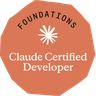
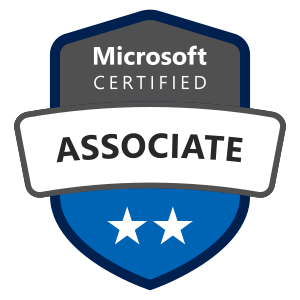
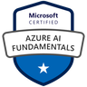
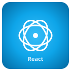

Hello there! 👋

I'm **Ved Gupta** ([@innovatorved](https://vedgupta.in))  
**Cloud Engineer | Full Stack & Generative AI | Azure & Google Cloud Certified**

> Open to Cloud Engineering, DevOps, Full Stack, and Generative AI roles — let's talk.

I started as a freelancer, writing applications with React, Next.js, JavaScript, and TypeScript, then grew into DevOps practices — containerizing with Docker and orchestrating with Kubernetes to ship applications reliably at scale.

Currently at LTIMindtree, I design and implement scalable Azure cloud infrastructure and write the application code that runs on it — AI-powered apps and agents using Azure OpenAI, not just the infrastructure around them.

Check out my [status page](https://status.vedgupta.in/) for updates on my projects and availability, or reach out to me at [me@vedgupta.in](mailto:me@vedgupta.in).

  
  
  
  
  
  
  
  

